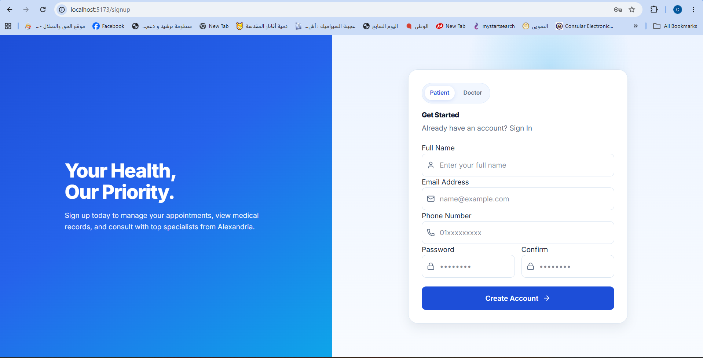
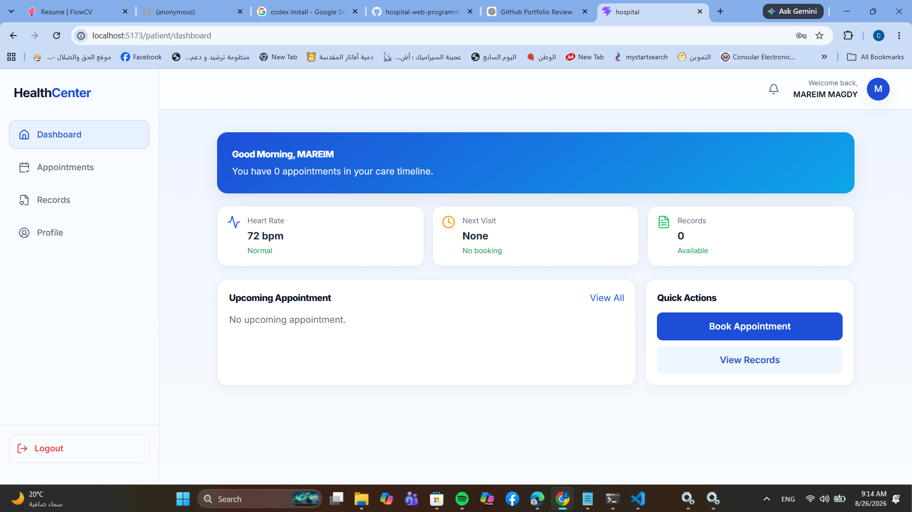
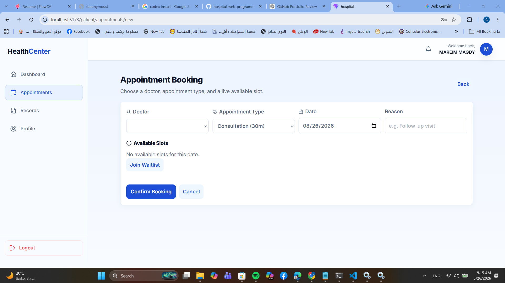
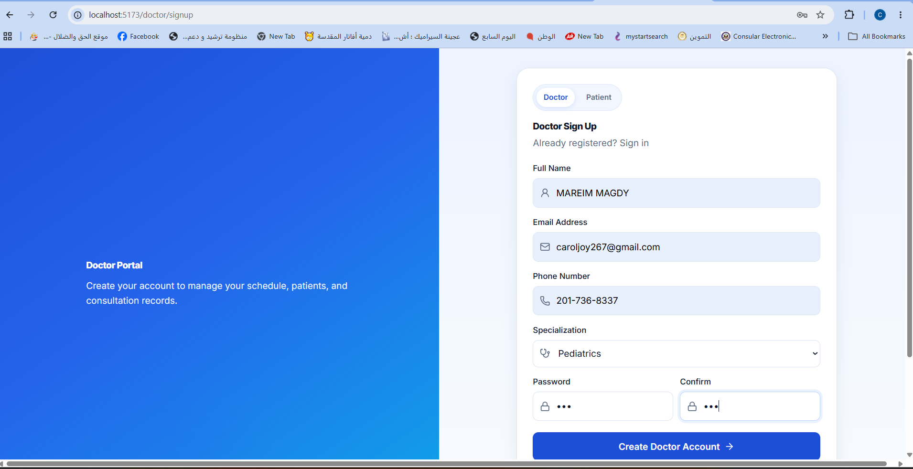
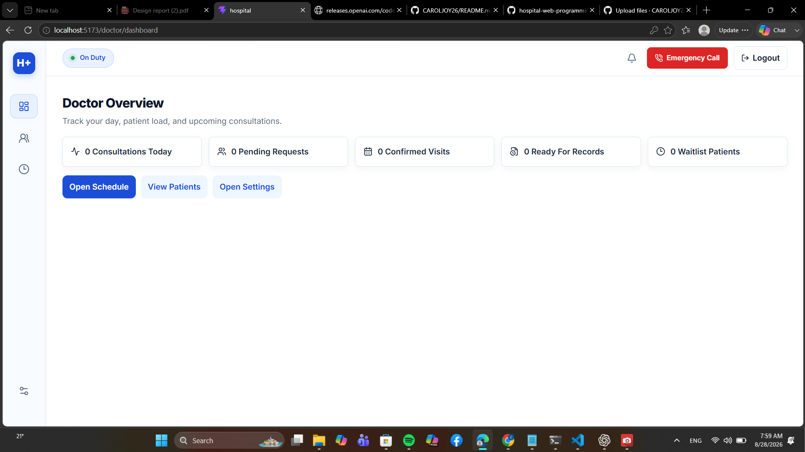

# 🏥 Hospital Management Web Application

A full-stack hospital management web application designed to support separate patient and doctor workflows, appointment management, medical records, schedules, notifications, and secure authentication.

## 🚀 Overview

This project was developed as a full-stack web application using React for the frontend and Node.js/Express for the backend.

The system provides different interfaces for patients and doctors and connects the frontend to a RESTful backend API with MongoDB.

## ✨ Features

### 👤 Patient Features
- Patient registration and login
- Patient dashboard
- Profile management
- Appointment booking
- Appointment details and management
- Medical records
- Prescription information
- Notifications

### 👨‍⚕️ Doctor Features
- Doctor registration and login
- Doctor dashboard
- Patient management
- Patient medical records
- Appointment management
- Doctor schedule
- Consultant profile
- Notifications

### 🔐 Backend Features
- REST API architecture
- JWT-based authentication
- Protected routes
- MongoDB database integration
- Mongoose models
- Controllers and services
- Authentication middleware
- Error handling
- Appointment and schedule services
- Medical record management
- Notification services

## 🛠️ Technologies Used

### Frontend
- React
- JavaScript
- Vite
- CSS
- React Router
- Axios

### Backend
- Node.js
- Express.js
- MongoDB
- Mongoose
- JWT

### Development Tools
- Git
- GitHub
- ESLint
- npm

## 📁 Project Structure

```text
hospital-web-programming/
│
├── Hospital/
│   ├── src/
│   │   ├── components/
│   │   ├── Layouts/
│   │   ├── modules/
│   │   │   ├── doctor/
│   │   │   ├── patient/
│   │   │   └── common/
│   │   ├── routes/
│   │   ├── services/
│   │   └── styles/
│   └── package.json
│
├── backend/
│   ├── src/
│   │   ├── config/
│   │   ├── controllers/
│   │   ├── middleware/
│   │   ├── models/
│   │   ├── routes/
│   │   ├── services/
│   │   ├── utils/
│   │   └── validators/
│   └── package.json
│
├── RUN_PROJECT.txt
├── TESTING_CHECKLIST.txt
└── README.md
## 📸 Screenshots

### Patient Sign In


### Patient Dashboard


### Appointments


### Doctor Sign In


### Doctor Dashboard

